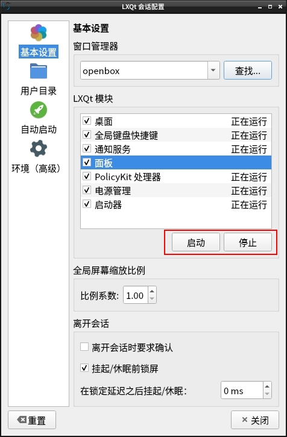

# LXQt-Panel plugin

## Dependence(plugin-example)
liblxqt1-dev, liblxqt-globalkeys-ui1-dev, liblxqt-globalkeys1-dev, libkf5windowsystem-dev, libqt5x11extras5-dev  

## Install
/usr/lib/x86_64-linux-gnu/lxqt-panel/*.so  
/usr/share/lxqt/lxqt-panel/*.desktop  

*.desktop  
[Desktop Entry]  
Type=Service  
ServiceTypes=LXQtPanel/Plugin  
Icon=clock  
Name=World Clock  
Comment=Displays a clock with calendar and time zones

## Restart
  
## Debug: 
`killall lxqt-panel && lxqt-panel &`  

~/.config/lxqt/panel.conf  
[pluginName]

## Rename
### Change file content
renameplugin.sh Example Datetime  
### Change file name
exampleplugin.cpp → datetimeplugin.cpp  
exampleplugin.h → datetimeplugin.h  
...  
example.desktop.in → datetime.desktop.in  
example.desktop.yaml → datetime.desktop.yaml

## datetime.desktop.yaml
Desktop Entry/Name: "Datetime"  
Desktop Entry/Comment: "Datetime Comment"  
Desktop Entry/Name[zh_CN]: "日期时间"  
Desktop Entry/Comment[zh_CN]: "日期时间插件"

## Attention
QStringLiteral("") needed.  
QString s(QByteArray) → QString s = QString::fromUtf8(QByteArray)  
configurationDialog do not use exec(), it will cause settings.setValue() fail.

## Reference
https://github.com/elviosak/plugin-example